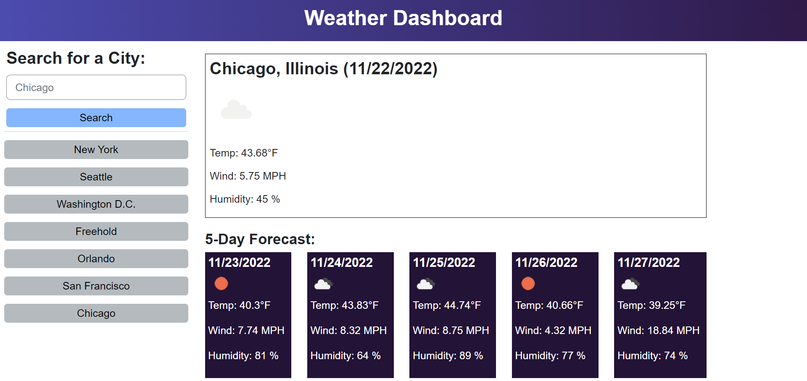

# Weather Dashboard

## Description

This application is a weather dashboard that displays the current weather and the 5-day forecast for any city that the user searches. The longitude and latitude coordinates of the city are passed to the OpenWeatherMap API to retrieve the weather data. The user's previous city searches are stored in the search history. The project was built so that users can plan a trip based on the weather outlook in their city. I built this project to work with retrieving data from a server-side API and displaying the information on the webpage using a combination of HTML, CSS, and JavaScript.

## Usage

Click on the website URL: https://avanimuchhala.github.io/weather-dashboard/

Once on the website, type in a city in the input textbox and click on "Search". To the right, the top section shows the current weather conditions (temperature, wind, humidity) for the searched city. The bottom section shows the 5-day forecast for the city. You can also click on any of the saved city buttons from previous searches on your browser in the search history to generate the weather outlook for that city.

Below is a screenshot of the website: 

## Credits

OpenWeatherMap API: https://openweathermap.org/api

Day.js: https://day.js.org/

## License

MIT License. Please refer to the LICENSE in the repo.

## How to Contribute

If you would like to contribute to this project, please email me at: avani.muchhala@case.edu.